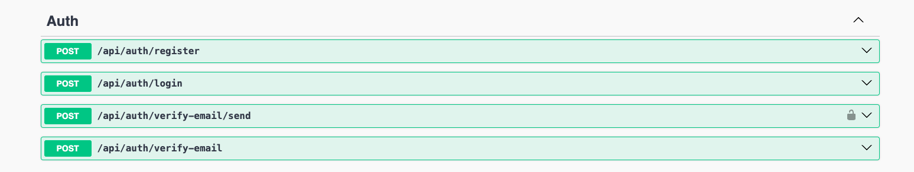
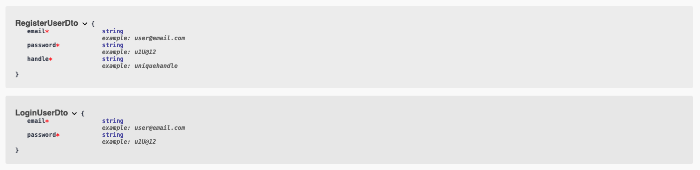

# Authentication Module

The responsibility of this module is to register and authenticate the users.

### Endpoints exposed:
1. POST /register
   - Calls user service which maintains the user details in user table
   - User service validates and stores the user details
   - Returns two tokens - accessToken (short lived), refreshToken (long lived)
2. POST /login
   - Calls user service to check if the request details are present
   - If present validates password
   - Returns two tokens - accessToken (short lived), refreshToken (long lived)
3. POST /verify-email/send
   - Mocks verify email (To keep things simple with respect to setting the SMTP Credentials)
   - Generates the email verification token which is supposed to be sent in email as an HTML template with button redirecting to the /verify-email?tokenId={tokenId}
   - For simplicity and validation I just return the token which can be directly used in verify-email api
4. POST /verify-email?tokenId={tokenId}
   - Checks if the token is valid and returns a success response

Once the service is setup using Docker Compose, the documentation can be accessed on
http://localhost:3081/game-service-doc

***

### Extras:
Dtos:

For verify-email/send endpoint -> Token needs to be used as bearer header which is received as part of login/register response