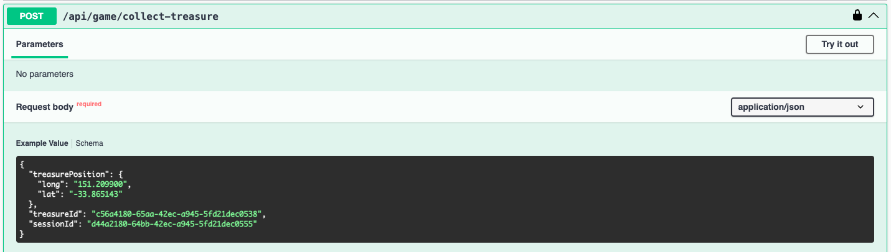

# Game Module

The responsibility of this module is to orchestrate the game and collect treasures.

## Endpoingts exposed:

### 1. GET session
Responsible for creating a session and returning a list of treasures along with a session id.

Idea is that whenever a user starts a session, Backend distributes a set of configured treasures at different location on a map. (For the simulation purpose I have assumed that it is earth)

How a Session is generated?
1. Step one is to get the list of all treasures which are configured by the system, I have added a db migration [here](../src/database/migrations/1719424961310-add-treasure-data.ts) which generates some sample treasures when server starts.
2. Generate a random sessionId
3. I have created a [Treasure Distribution Service](../src/modules/game/services/treasure-distribution.service.ts) whose responsibility is to distribute treasures. It generates some random coordinates using an algorithm - can be visualized [here on codepen](https://codepen.io/Sushil-Maurya-the-builder/pen/JjqwEgW)
4. Once the coordinates are generated the treasures from step 1 are allocated to these positions and it's stored in cache for a sessionId with a TTL of 10 mins. (I am assuming a session lasts for 10 mins).

[Sample Response File](./sample-response/session_response.json) where `id` is the session id and `treasures` is a list of treasures which can be collected by the user.

> NOTE: This is only for test purpose - Ideally it should be communicated to client through a secure real time channel as in websockets.

***

### 2. POST collect-treasure
This endpoint is used to collect a treasure
Client sends the treasure as data object containing `sessionId`, `position` of treasure and `treasureId`, all are dependent on session.

How the treasures are collected and made sure that it's not manipulation or duplication?
1. First the location is validated, I have created a [User Location Service](../src/modules/game/services/user-location.service.ts) whose responsibility is to check if the treasure's location and the last known user position is within the permissible limit which is defined by permissible speed of user for test purpose I have considered (hard coded) speed of 1km/sec is permissible. The idea is to detect bot which can exploit the game logic.
2. Next step is to validate if teh treasure location is present in cache which was created at Step 4 in session creation. [Treasure Distribution Service](../src/modules/game/services/treasure-distribution.service.ts) is responsible for this validation. Idea is to check the integrity of the treasures. It checks the position based on treasure id and session id.
3. Next step is to validate the daily and weekly collection limits. This is managed by [treasure collection limit service](../src/modules/treasure/services/collection-limit.service.ts). I am storing the daily collection per user in cache with a ttl set so that it expires after a week. Given a date I check if the configured daily and weekly limit is violated.
4. If all the checks are valid:
   - Start a transaction.
   - Store the treasure.
   - Update the cache for current day treasure count.
   - Remove treasure from session cache so that, it cannot be collected again.

